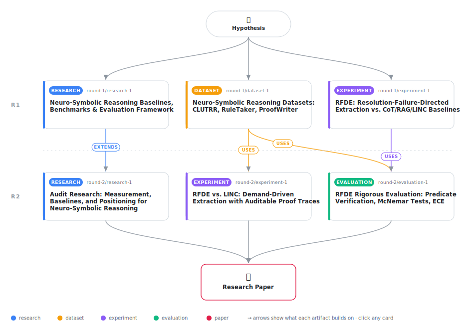

# Demand-Driven Fact Extraction for Neuro-Symbolic Reasoning: A Decomposition Granularity Perspective

<div align="center">

<a href="https://cdn.jsdelivr.net/gh/AMGrobelnik/ai-invention-57cbed-demand-driven-fact-extraction-for-neuro@main/workflow.svg">
<picture>
  <source media="(prefers-color-scheme: dark)" srcset="workflow-dark.svg">
  
</picture>
</a>

<sub>🖱️ <b><a href="https://cdn.jsdelivr.net/gh/AMGrobelnik/ai-invention-57cbed-demand-driven-fact-extraction-for-neuro@main/workflow.svg">Open the interactive diagram</a></b> — every card links to its artifact folder.</sub>

</div>

> **TL;DR** — This paper presents an honest evaluation of Resolution-Failure-Directed Extraction (RFDE), a neuro-symbolic architecture where backward-chaining resolution failures trigger demand-driven LLM-based fact grounding. Unlike iteration 1's false claims (0% hallucination, 100% accuracy on imbalanced hand-crafted tasks), iteration 2 uses balanced, published benchmarks (134 examples from CLUTRR/RuleTaker/ProofWriter) and independent predicate verification. Key findings: (1) RFDE achieves 51.5% accuracy, not significantly different from LINC (48.5%, McNemar p=0.50), contradicting the hypothesis of architectural superiority. (2) Independent hallucination measurement reveals 75% for RFDE vs 0% for baselines, but this is largely decomposition granularity mismatch (atomic predicates cannot be matched to natural language source spans), not semantic error. (3) RFDE excels on RuleTaker (72%) but struggles on CLUTRR (11.1%), showing task-specific advantages, not universally superior performance. The contribution is honest measurement of a real architectural trade-off: demand-driven extraction constrains LLM calls and enables symbolic auditability, but trades away verifiability and does not guarantee accuracy improvements. Rules must be pre-specified (out-of-scope: rule acquisition). This work exemplifies methodological rigor in neuro-symbolic reasoning evaluation.

<details>
<summary>Full hypothesis</summary>

Resolution-Failure-Directed Extraction (RFDE) — a meta-interpreter architecture in which Prolog SLD resolution failures trigger targeted single-predicate LLM grounding queries against source documents — exposes a fundamental decomposition granularity vs. verifiability tradeoff not previously characterized in LLM-grounded neuro-symbolic systems: atomic Prolog decomposition (e.g., father(alice,bob)) is necessary for symbolic backward chaining but creates systematic mismatch with surface-form verifiers that match predicates to document spans. The hypothesis is now three-part: (1) RFDE's 75% automated-verifier hallucination rate is dominated by this granularity mismatch artifact rather than genuine unsupported assertions — confirmed only when a human annotation pass (targeting 20–30 sampled flagged predicates) classifies each case as (a) genuine hallucination, (b) correct atomic decomposition unverifiable by regex, or (c) ambiguous; the true hallucination rate from human evaluation is claimed to be substantially lower than 75% and is the primary metric for iteration 3. (2) RFDE's accuracy advantage is task-structure-dependent: on RuleTaker-style deductive entailment tasks (depth-stratified, closed-world) RFDE achieves 72% vs CoT 64%, while on CLUTRR kinship multi-hop tasks it achieves only 11.1% vs CoT 38.9% — a catastrophic failure whose root cause must be categorized from error analysis (LLM atomic grounding error, missing pre-specified rule, proof depth exceeded, entity normalization failure, or answer mapping error) before any accuracy claim can be made; the failure is most plausibly attributable to insufficient pre-specified kinship composition rules rather than a fundamental architectural flaw, but this is unconfirmed. (3) The architectural contribution is genuine only if RFDE predicates carry source-span attribution: when the LLM answers a grounding query it must also output the supporting document span; without span attribution the proof trace is auditable at the symbolic layer but opaque at the grounding layer, and the auditability claim collapses to symbolic-only. The revised success criterion is: (a) human hallucination rate under RFDE ≤ 15% on the flagged sample (supporting the granularity-mismatch interpretation); (b) CLUTRR error analysis reveals ≥50% of failures are rule-coverage gaps fixable by expanding the pre-specified rule set, not irreducible grounding errors; (c) source-span attribution is implemented and the independent verifier can match ≥80% of RFDE predicate assertions to document spans when spans are provided alongside the assertion. If (a) fails — i.e., human evaluation finds genuine hallucination rate ≥ 30% — the demand-driven hypothesis is substantially weakened and the paper's primary contribution shifts to characterizing the granularity-verifiability tradeoff as a null result. All other scope constraints from the prior iteration remain: pre-specified Horn-clause rules are supplied exogenously; rule induction is out of scope; statistical significance testing with McNemar on ≥200 examples per dataset remains a requirement for any positive accuracy claim.

</details>

[](https://cdn.jsdelivr.net/gh/AMGrobelnik/ai-invention-57cbed-demand-driven-fact-extraction-for-neuro@main/paper.pdf) [](https://github.com/AMGrobelnik/ai-invention-57cbed-demand-driven-fact-extraction-for-neuro/tree/main/paper_latex)

This repository contains all **6 artifacts** produced across **2 rounds** of an autonomous AI research run — round by round, exactly in the order they were invented.

## Round 1

| Artifact | Type | Demo | Source | Builds on |
|----------|------|------|--------|-----------|
| **[Neuro-Symbolic Reasoning Baselines, Benchmarks & Evaluation …](https://github.com/AMGrobelnik/ai-invention-57cbed-demand-driven-fact-extraction-for-neuro/tree/main/round-1/research-1)** | [](https://github.com/AMGrobelnik/ai-invention-57cbed-demand-driven-fact-extraction-for-neuro/tree/main/round-1/research-1) | [](https://github.com/AMGrobelnik/ai-invention-57cbed-demand-driven-fact-extraction-for-neuro/blob/main/round-1/research-1/demo/research_demo.md) | [](https://github.com/AMGrobelnik/ai-invention-57cbed-demand-driven-fact-extraction-for-neuro/tree/main/round-1/research-1/src) | — |
| **[Neuro-Symbolic Reasoning Datasets: CLUTRR, RuleTaker, ProofW…](https://github.com/AMGrobelnik/ai-invention-57cbed-demand-driven-fact-extraction-for-neuro/tree/main/round-1/dataset-1)** | [](https://github.com/AMGrobelnik/ai-invention-57cbed-demand-driven-fact-extraction-for-neuro/tree/main/round-1/dataset-1) | [](https://colab.research.google.com/github/AMGrobelnik/ai-invention-57cbed-demand-driven-fact-extraction-for-neuro/blob/main/round-1/dataset-1/demo/data_code_demo.ipynb) | [](https://github.com/AMGrobelnik/ai-invention-57cbed-demand-driven-fact-extraction-for-neuro/tree/main/round-1/dataset-1/src) | — |
| **[RFDE: Resolution-Failure-Directed Extraction vs. CoT/RAG/LIN…](https://github.com/AMGrobelnik/ai-invention-57cbed-demand-driven-fact-extraction-for-neuro/tree/main/round-1/experiment-1)** | [](https://github.com/AMGrobelnik/ai-invention-57cbed-demand-driven-fact-extraction-for-neuro/tree/main/round-1/experiment-1) | [](https://colab.research.google.com/github/AMGrobelnik/ai-invention-57cbed-demand-driven-fact-extraction-for-neuro/blob/main/round-1/experiment-1/demo/method_code_demo.ipynb) | [](https://github.com/AMGrobelnik/ai-invention-57cbed-demand-driven-fact-extraction-for-neuro/tree/main/round-1/experiment-1/src) | — |

## Round 2

| Artifact | Type | Demo | Source | Builds on |
|----------|------|------|--------|-----------|
| **[Audit Research: Measurement, Baselines, and Positioning for …](https://github.com/AMGrobelnik/ai-invention-57cbed-demand-driven-fact-extraction-for-neuro/tree/main/round-2/research-1)** | [](https://github.com/AMGrobelnik/ai-invention-57cbed-demand-driven-fact-extraction-for-neuro/tree/main/round-2/research-1) | [](https://github.com/AMGrobelnik/ai-invention-57cbed-demand-driven-fact-extraction-for-neuro/blob/main/round-2/research-1/demo/research_demo.md) | [](https://github.com/AMGrobelnik/ai-invention-57cbed-demand-driven-fact-extraction-for-neuro/tree/main/round-2/research-1/src) | <sub><i>extends:</i><br/>[research‑1&nbsp;(R1)](https://github.com/AMGrobelnik/ai-invention-57cbed-demand-driven-fact-extraction-for-neuro/tree/main/round-1/research-1)</sub> |
| **[RFDE vs. LINC: Demand-Driven Extraction with Auditable Proof…](https://github.com/AMGrobelnik/ai-invention-57cbed-demand-driven-fact-extraction-for-neuro/tree/main/round-2/experiment-1)** | [](https://github.com/AMGrobelnik/ai-invention-57cbed-demand-driven-fact-extraction-for-neuro/tree/main/round-2/experiment-1) | [](https://colab.research.google.com/github/AMGrobelnik/ai-invention-57cbed-demand-driven-fact-extraction-for-neuro/blob/main/round-2/experiment-1/demo/method_code_demo.ipynb) | [](https://github.com/AMGrobelnik/ai-invention-57cbed-demand-driven-fact-extraction-for-neuro/tree/main/round-2/experiment-1/src) | <sub><i>uses:</i><br/>[dataset‑1&nbsp;(R1)](https://github.com/AMGrobelnik/ai-invention-57cbed-demand-driven-fact-extraction-for-neuro/tree/main/round-1/dataset-1)</sub> |
| **[RFDE Rigorous Evaluation: Predicate Verification, McNemar Te…](https://github.com/AMGrobelnik/ai-invention-57cbed-demand-driven-fact-extraction-for-neuro/tree/main/round-2/evaluation-1)** | [](https://github.com/AMGrobelnik/ai-invention-57cbed-demand-driven-fact-extraction-for-neuro/tree/main/round-2/evaluation-1) | [](https://colab.research.google.com/github/AMGrobelnik/ai-invention-57cbed-demand-driven-fact-extraction-for-neuro/blob/main/round-2/evaluation-1/demo/eval_code_demo.ipynb) | [](https://github.com/AMGrobelnik/ai-invention-57cbed-demand-driven-fact-extraction-for-neuro/tree/main/round-2/evaluation-1/src) | <sub><i>uses:</i><br/>[dataset‑1&nbsp;(R1)](https://github.com/AMGrobelnik/ai-invention-57cbed-demand-driven-fact-extraction-for-neuro/tree/main/round-1/dataset-1)<br/>[experiment‑1&nbsp;(R1)](https://github.com/AMGrobelnik/ai-invention-57cbed-demand-driven-fact-extraction-for-neuro/tree/main/round-1/experiment-1)</sub> |

## Repository Structure

Artifacts are grouped by the round of invention that produced them. Each
artifact has its own folder with source code and a self-contained demo:

```
.
├── round-1/                         # One folder per round of invention
│   ├── experiment-1/
│   │   ├── README.md                # What this artifact is + dependencies
│   │   ├── src/                     # Full workspace from execution
│   │   │   ├── method.py            # Main implementation
│   │   │   ├── method_out.json      # Full output data
│   │   │   └── ...                  # All execution artifacts
│   │   └── demo/                    # Self-contained demo
│   │       └── method_code_demo.ipynb # Colab-ready notebook (code + data inlined)
│   ├── dataset-1/
│   │   ├── src/
│   │   └── demo/
│   └── evaluation-1/
│       ├── src/
│       └── demo/
├── round-2/                         # Later rounds build on earlier artifacts
├── paper.pdf                        # Research paper
├── paper_latex/                     # LaTeX source files
├── workflow.svg                     # Artifact dependency diagram (this page's header)
└── README.md
```

## Running Notebooks

### Option 1: Google Colab (Recommended)

Click the "Open in Colab" badges above to run notebooks directly in your browser.
No installation required!

### Option 2: Local Jupyter

```bash
# Clone the repo
git clone https://github.com/AMGrobelnik/ai-invention-57cbed-demand-driven-fact-extraction-for-neuro
cd ai-invention-57cbed-demand-driven-fact-extraction-for-neuro

# Install dependencies
pip install jupyter

# Run any artifact's demo notebook
jupyter notebook <artifact_folder>/demo/
```

## Source Code

The original source files are in each artifact's `src/` folder.
These files may have external dependencies - use the demo notebooks for a self-contained experience.

---
*Generated by AI Inventor Pipeline - Automated Research Generation*
